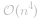
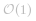
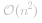
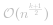
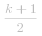
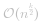
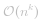

[TOC]

## Solution

This problem is a variation of [4Sum](https://leetcode.com/articles/4sum/), and we recommend checking that problem first. The main difference is that here we pick each element from a different array, while in 4Sum all elements come from the same array. For that reason, we cannot use the [Two Pointers](https://leetcode.com/articles/4sum/#approach-1-two-pointers) approach, where elements must be in the same sorted array.

On the bright side, we do not need to worry about using the same element twice - we pick one element at a time from each array. As you will see later, this help reduce the time complexity.

Finally, we do not need to return actual values and ensure they are unique; we just count each combination of four elements that sums to zero.

---

#### Approach 1: Hashmap

A brute force solution will be to enumerate all combinations of elements using four nested loops, which results in   time complexity. A faster approach is to use three nested loops, and, for each sum `a + b + c`, search for a complementary value `d == -(a + b + c)` in the fourth array. We can do the search in   if we populate the fourth array into a hashmap.

> Note that we need to track the frequency of each element in the fourth array. If an element is repeated multiple times, it will form multiple quadruples. Therefore, we will use hashmap values to store counts.

Building further on this idea, we can observe that `a + b == -(c + d)`. First, we will count sums of elements `a + b` from the first two arrays using a hashmap. Then, we will enumerate elements from the third and fourth arrays, and search for a complementary sum `a + b == -(c + d)` in the hashmap.

                

**Algorithm**

1. For each `a` in `A`.
    - For each `b` in `B`.
        - If `a + b` exists in the hashmap `m`, increment the value.
        - Else add a new key `a + b` with the value `1`.

2. For each `c` in `C`.
    - For each `d` in `D`.
        - Lookup key `-(c + d)` in the hashmap `m`.
        - Add its value to the count `cnt`.

3. Return the count `cnt`.

```
int fourSumCount(vector<int>& A, vector<int>& B, vector<int>& C, vector<int>& D) {
    int cnt = 0;
    unordered_map<int, int> m;
    for (int a : A)
        for (int b : B)
            ++m[a + b];
    for (int c : C)
        for (int d : D) {
            auto it = m.find(-(c + d));
            if (it != end(m))
                cnt += it->second;
        }
    return cnt;
}
```

**Complexity Analysis**

- Time Complexity:  . We have 2 nested loops to count sums, and another 2 nested loops to find complements.

- Space Complexity:   for the hashmap. There could be up to   distinct `a + b` keys.

---

#### Approach 2: kSum II

After you solve 4Sum II, an interviewer can follow-up with 5Sum II, 6Sum II, and so on. What they are really expecting is a generalized solution for `k` input arrays. Fortunately, the hashmap approach can be easily extended to handle more than 4 arrays.

Above, we divided 4 arrays into two equal groups, and processed each group independently. Same way, we will divide *k* arrays into two groups. For the first group, we will have   nested loops to count sums. Another   nested loops will enumerate arrays in the second group and search for complements.

**Algorithm**

We can implement   nested loops using a recursion, passing the index `i` of the current list as the parameter. The first group will be processed by `addToHash` recursive function, which accumulates `sum` and terminates when adding the final sum to a hashmap `m`.

The second function, `countComplements`, will process the other group, accumulating the `complement` value. In the end, it searches for the final `complement` value in the hashmap and adds its count to the result.

```
int fourSumCount(vector<int>& A, vector<int>& B, vector<int>& C, vector<int>& D) {
    return kSumCount(vector<vector<int>>() = {A, B, C, D});
}
int kSumCount(vector<vector<int>> &lists) {
    unordered_map<int, int> m;
    addToHash(lists, m, 0, 0);
    return countComplements(lists, m, lists.size() / 2, 0);
}
void addToHash(vector<vector<int>> &lists, unordered_map<int, int> &m, int i, int sum) {
    if (i == lists.size() / 2)
        ++m[sum];
    else
        for (int a : lists[i])
            addToHash(lists, m, i + 1, sum + a);
}
int countComplements(vector<vector<int>> &lists, unordered_map<int, int> &m, int i, int complement) {
    if (i == lists.size()) {
        auto it = m.find(complement);
        return it == end(m) ? 0 : it->second;
    }
    int cnt = 0;
    for (int a : lists[i])
        cnt += countComplements(lists, m, i + 1, complement - a);
    return cnt;
}
```

**Complexity Analysis**

- Time Complexity:  , or   for 4Sum II. We have   nested loops to count sums, and another   nested loops to find complements.

    If the number of arrays is odd, the time complexity will be  . We will pass   arrays to `addToHash`, and   arrays to `kSumCount` to keep the space complexity  .

- Space Complexity:   for the hashmap. The space needed for the recursion will not exceed  .

---

#### Further Thoughts

For an interview, keep in mind the generalized implementation. Even if your interviewer is OK with a simpler code, you'll get some extra points by describing how your solution can handle more than 4 arrays.

It's also important to discuss trade-offs with your interviewer. If we are tight on memory, we can move some arrays from the first group to the second. This, of course, will increase the time complexity.

In other words, the time complexity can range from   to  , and the memory complexity ranges from   to   accordingly.